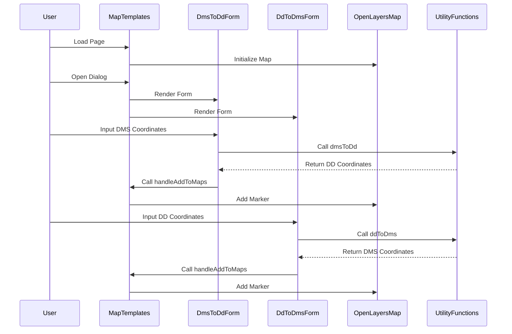

# React + TypeScript + Vite

## Struktur Folder Project

Struktur folder project ini menerapkan atomic design, sehingga terdapat beberapa folder yang harus diperhatikan:

- `src/components` : berisi komponen-komponen yang digunakan pada project ini
- `src/components/atoms` : berisi komponen-komponen yang merupakan bagian terkecil dari project ini
- `src/components/molecules` : berisi komponen-komponen yang merupakan gabungan dari komponen atoms
- `src/components/organisms` : berisi komponen-komponen yang merupakan gabungan dari komponen molecules
- `src/components/templates` : berisi komponen-komponen yang merupakan gabungan dari komponen organisms
- `src/components/ui` : berisi komponen-komponen styling bawaan dari shadcn ui yang digunakan pada project ini
- `src/lib` : berisi utility komponen shadcn ui yang digunakan pada project ini
- `src/pages` : berisi halaman-halaman yang digunakan pada project ini
- `src/utils` : berisi utility yang digunakan pada project ini

## Dependencies yang Digunakan

Berikut merupakan dependencies yang digunakan pada project ini:

- `@tailwindcss` : digunakan untuk styling pada project ini
- `@shadcn/ui` : digunakan untuk library component styling pada project ini
- `@jest` : digunakan untuk testing pada project ini
- `@openlayers` : digunakan untuk menampilkan peta pada project ini
- `@tsdoc` : digunakan untuk membuat dokumentasi pada project ini
- `@lucide-react` : digunakan untuk menampilkan icon pada project ini

## Langkah Instalasi Project

Berikut merupakan tahapan untuk menginstal project ini:

- Buka terminal sesuai dengan directory yang diinginkan
- Lakukan `git clone` pada repository ini:

```js
git clone git@github.com:rstubryan/len-osm.git
```

- Lalu masuk ke directory `len-osm`
- Jalankan `npm install`
- Lalu ketika sudah ter-install maka jalankan `npm run dev`

## Langkah Testing dengan Jest

Berikut merupakan tahapan untuk melakukan testing pada project ini:

- Masuk ke directory `len-osm`
- Lalu jalankan `npm test` pada terminal

## Sequence Diagram



## Class Diagram

```mermaid
classDiagram
    class MapTemplates {
        +MapTemplates()
        +useEffect()
        +handleAddToMaps(lat: number, long: number)
    }

    class DmsToDdForm {
        +DmsToDdForm(onAddToMaps: (lat: number, long: number) => void)
        +handleConvert()
        +handleAddToMapsClick()
    }

    class DdToDmsForm {
        +DdToDmsForm(onAddToMaps: (lat: number, long: number) => void)
        +handleConvert()
        +handleAddToMapsClick()
    }

    class UtilityFunctions {
        +dmsToDd(degrees: number, minutes: number, seconds: number, direction: string): number
        +ddToDms(decimalDegrees: number): { degrees: number, minutes: number, seconds: number, direction: string }
    }

    class OpenLayersMap {
        +Map()
        +View()
        +TileLayer()
        +OSM()
        +fromLonLat()
        +Feature()
        +Point()
        +VectorSource()
        +VectorLayer()
        +Style()
        +Icon()
    }

    MapTemplates --> DmsToDdForm : uses
    MapTemplates --> DdToDmsForm : uses
    MapTemplates --> OpenLayersMap : uses
    DmsToDdForm --> UtilityFunctions : uses
    DdToDmsForm --> UtilityFunctions : uses
```